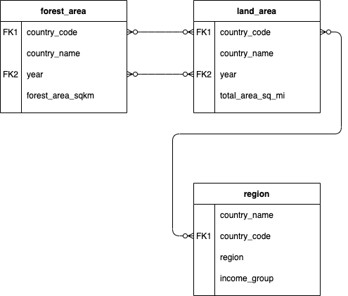

# SQL Analysis for Deforestation Exploration
## By Murong (Sophie) Cui

##Introduction
As a data analyst for ForestQuery, a non-profit organization. on a mission to reduce deforestation around the world and which raises awareness about this important environmental topic.

The executive director and her leadership team members are looking to understand which countries and regions around the world seem to have forests that have been shrinking in size, and also which countries and regions have the most significant forest area, both in terms of amount and percent of total area. The hope is that these findings can help inform initiatives, communications, and personnel allocation to achieve the largest impact with the precious few resources that the organization has at its disposal.

I’ve been able to find tables of data online dealing with forestation as well as total land area and region groupings, and you’ve brought these tables together into a database that you’d like to query to answer some of the most important questions in preparation for a meeting with the ForestQuery executive team coming up in a few days. Ahead of the meeting, you’d like to prepare and disseminate a report for the leadership team that uses complete sentences to help them understand the global deforestation overview between 1990 and 2016.

## Global Situation
According to the World Bank, the total forest area of the world was ​41282694.9 sq km ​in 1990. As of 2016, the most recent year for which data was available, that number had fallen to ​39958245.9 sq km​, a loss of ​1324449.0 sq km ​, or ​3.208​%.
The forest area lost over this time period is slightly more than the entire land area of Peru listed for the year 2016 (which is ​1279999.9891 sq km​).

## Regional Outlook
In 2016, the percent of the total land area of the world designated as forest was ​31.375​%. The region with the highest relative forestation was ​Latin America & Caribbean​, with ​46.16​%, and the region with the lowest relative forestation was ​Middle East & North Africa​, with​2.07​ % forestation.
In 1990, the percent of the total land area of the world designated as forest was ​32.422%​. The region with the highest relative forestation was ​Latin America & Caribbean​, with​ 51.03​%, and the region with the lowest relative forestation was ​Middle East & North Africa​, with ​1.78​% forestation.
The only regions of the world that decreased in percent forest area from 1990 to 2016 were ​Latin America & Caribbean ​(dropped from 51.03% to 46.16%) and ​Sub-Saharan Africa​(30.67% to28.79%). All other regions actually increased in forest area over this time period. However, the drop in forest area in the two aforementioned regions was so large, the percent forest area of the world decreased over this time period from 32.42% to 31.38%.

## Country-Level Detail
A. SUCCESS STORIES

There is one particularly bright spot in the data at the country level, China . This country actually increased in forest area from 1990 to 2016 by ​527229.06 sq km​. It would be interesting to study what has changed in this country over this time to drive this figure in the data higher. The country with the next largest increase in forest area from 1990 to 2016 was the ​United States​, but it only saw an increase of ​79200 sq km​, much lower than the figure for China.
China and the United States are of course very large countries in total land area, so when we look at the largest ​percent​ change in forest area from 1990 to 2016, we aren’t surprised to find a much smaller country listed at the top. ​French Polynesia ​increased in forest area by 27.322% from 1990 to 2016.

B. LARGEST CONCERNS

Which countries are seeing deforestation to the largest degree? We can answer this question in two ways. First, we can look at the absolute square kilometer decrease in forest area from 1990 to 2016. The following 3 countries had the largest decrease in forest area over the time period under consideration.

C. QUARTILES

The largest number of countries in 2016 were found in the 1 quartile.
There were 9 countries in the top quartile in 2016. These are countries with a very high percentage of their land area designated as forest. The following is a list of countries and their respective forest land, denoted as a percentage.

## Recommendations
Write out a set of recommendations as an analyst on the ForestQuery team.
- What have you learned from the World Bank data?
- Which countries should we focus on over others?
Overall, deforestation problems should really catch our eyes. From 1990 to 2016, the total deforestation amount reached 1324449.0 sq km.
And we should focus on the countries in the region of Sub-Saharan Africa and the countries with low income.
